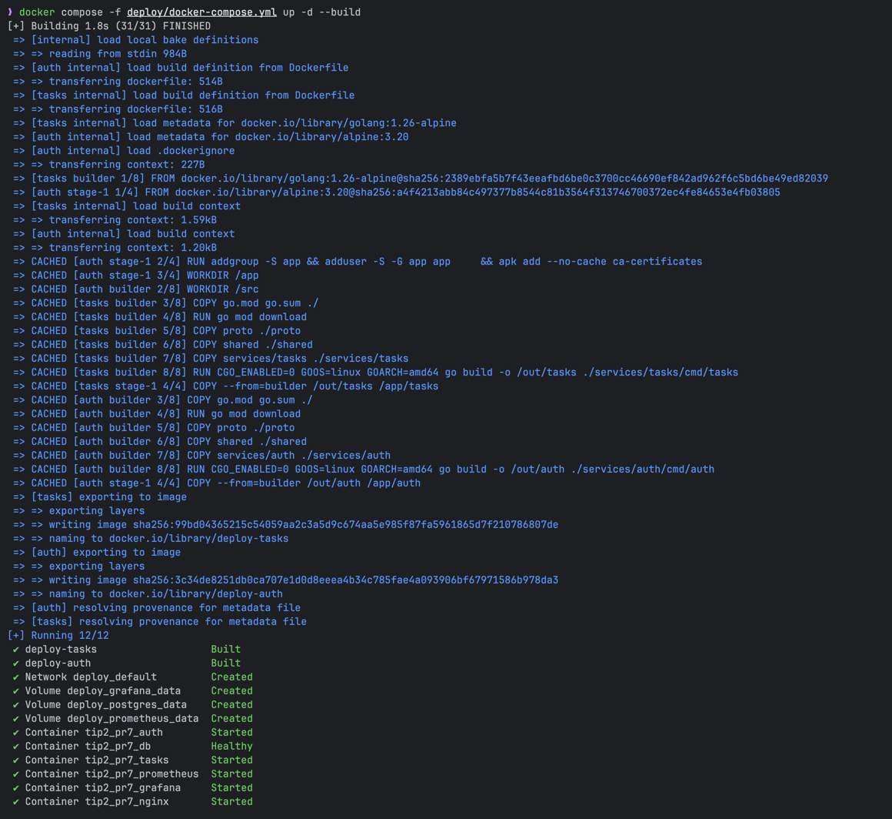
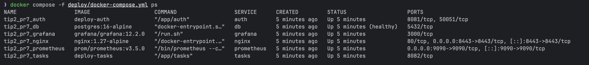
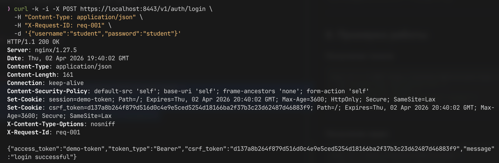
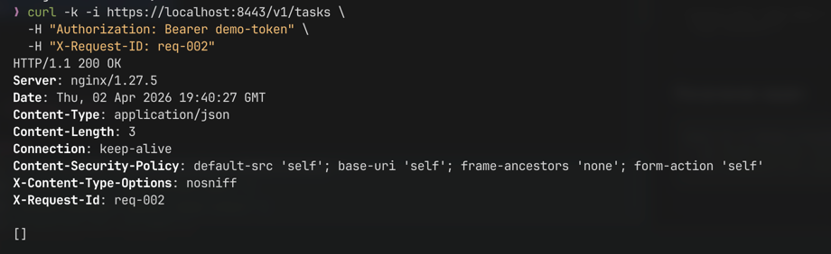
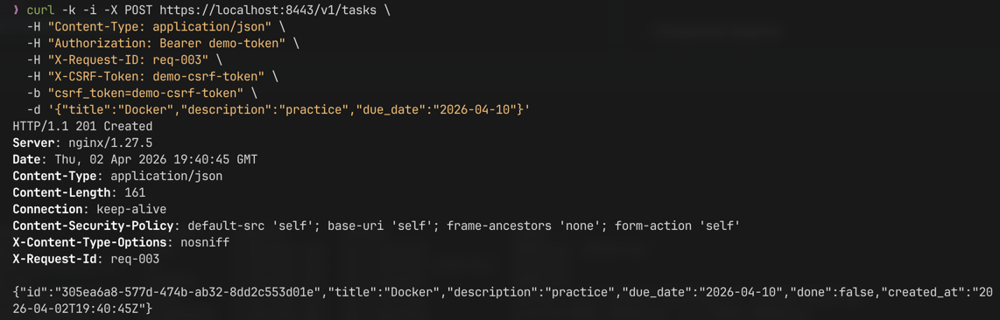

# Практическое занятие №7  
## Рузин Иван Александрович ЭФМО-01-25  
### Контейнеризация Go-сервиса. Dockerfile и запуск контейнера

---

## 1. Краткое описание

В рамках работы реализована контейнеризация микросервисного приложения на Go.

В проекте присутствуют следующие сервисы:

- **auth** — сервис аутентификации (HTTP + gRPC)
- **tasks** — сервис задач (HTTP API)
- **db** — PostgreSQL
- **nginx** — reverse proxy
- **prometheus** — сбор метрик
- **grafana** — визуализация метрик

Вся система поднимается одной командой через **docker-compose**.

---

## 2. Архитектура

```mermaid
graph TD

Client --> Nginx

Nginx --> Tasks
Nginx --> Auth
Nginx --> Grafana

Tasks --> Auth
Tasks --> DB

Prometheus --> Tasks
Grafana --> Prometheus
````

---

## 3. Структура проекта

```text
tip2_pr7/
  services/
    auth/
      Dockerfile
    tasks/
      Dockerfile
  deploy/
    docker-compose.yml
    .env
    nginx.conf
    monitoring/
      prometheus.yml
      grafana/
  proto/
  shared/
```

---

## 4. Dockerfile (multi-stage)

Для сервисов используется multi-stage сборка:

### Этапы

1. **builder**

    * используется `golang:alpine`
    * скачиваются зависимости
    * собирается бинарник

2. **runner**

    * используется `alpine`
    * копируется только бинарник
    * минимальный размер образа

Auth:

```dockerfile
FROM golang:1.26-alpine AS builder
WORKDIR /src
COPY go.mod go.sum ./
RUN go mod download
COPY proto ./proto
COPY shared ./shared
COPY services/auth ./services/auth
RUN CGO_ENABLED=0 GOOS=linux GOARCH=amd64 go build -o /out/auth ./services/auth/cmd/auth

FROM alpine:3.20

RUN addgroup -S app && adduser -S -G app app \
    && apk add --no-cache ca-certificates

WORKDIR /app
COPY --from=builder /out/auth /app/auth
USER app
EXPOSE 8081 50051
ENTRYPOINT ["/app/auth"]
```

Tasks:

```dockerfile
FROM golang:1.26-alpine AS builder
WORKDIR /src
COPY go.mod go.sum ./
RUN go mod download
COPY proto ./proto
COPY shared ./shared
COPY services/tasks ./services/tasks
RUN CGO_ENABLED=0 GOOS=linux GOARCH=amd64 go build -o /out/tasks ./services/tasks/cmd/tasks

FROM alpine:3.20

RUN addgroup -S app && adduser -S -G app app \
    && apk add --no-cache ca-certificates

WORKDIR /app
COPY --from=builder /out/tasks /app/tasks
USER app
EXPOSE 8082
ENTRYPOINT ["/app/tasks"]
```

---

## 5. Переменные окружения

Все переменные вынесены в `.env`:

```env
AUTH_PORT=8081
TASKS_PORT=8082

POSTGRES_DB=tasksdb
POSTGRES_USER=tasks
POSTGRES_PASSWORD=tasks

TASKS_DB_DSN=postgres://tasks:tasks@db:5432/tasksdb?sslmode=disable

AUTH_GRPC_ADDR=auth:50051

GRAFANA_ADMIN_USER=admin
GRAFANA_ADMIN_PASSWORD=admin

NGINX_PORT=8443
```

Переменные подключаются через:

```yaml
env_file:
  - .env
```

---

## 6. docker-compose

Система поднимается через `docker-compose`:

```yaml
services:
  db:
    image: postgres:16-alpine
    container_name: tip2_pr7_db
    env_file:
      - .env
    environment:
      POSTGRES_DB: "${POSTGRES_DB}"
      POSTGRES_USER: "${POSTGRES_USER}"
      POSTGRES_PASSWORD: "${POSTGRES_PASSWORD}"
    volumes:
      - postgres_data:/var/lib/postgresql/data
      - ./db/init.sql:/docker-entrypoint-initdb.d/init.sql:ro
    healthcheck:
      test: ["CMD-SHELL", "pg_isready -U ${POSTGRES_USER} -d ${POSTGRES_DB}"]
      interval: 5s
      timeout: 5s
      retries: 10
    restart: unless-stopped

  auth:
    build:
      context: ..
      dockerfile: services/auth/Dockerfile
    container_name: tip2_pr7_auth
    env_file:
      - .env
    environment:
      AUTH_PORT: "${AUTH_PORT}"
      AUTH_GRPC_PORT: "${AUTH_GRPC_PORT}"
    expose:
      - "${AUTH_PORT}"
      - "${AUTH_GRPC_PORT}"
    restart: unless-stopped

  tasks:
    build:
      context: ..
      dockerfile: services/tasks/Dockerfile
    container_name: tip2_pr7_tasks
    depends_on:
      db:
        condition: service_healthy
      auth:
        condition: service_started
    env_file:
      - .env
    environment:
      TASKS_PORT: "${TASKS_PORT}"
      AUTH_GRPC_ADDR: "${AUTH_GRPC_ADDR}"
      TASKS_DB_DSN: "${TASKS_DB_DSN}"
    expose:
      - "${TASKS_PORT}"
    restart: unless-stopped

  prometheus:
    image: prom/prometheus:v3.5.0
    container_name: tip2_pr7_prometheus
    depends_on:
      - tasks
    env_file:
      - .env
    command:
      - "--config.file=/etc/prometheus/prometheus.yml"
      - "--storage.tsdb.path=/prometheus"
      - "--web.enable-lifecycle"
    volumes:
      - ./monitoring/prometheus.yml:/etc/prometheus/prometheus.yml:ro
      - prometheus_data:/prometheus
    ports:
      - "${PROMETHEUS_PORT}:9090"
    restart: unless-stopped

  grafana:
    image: grafana/grafana:12.2.0
    container_name: tip2_pr7_grafana
    depends_on:
      - prometheus
    env_file:
      - .env
    environment:
      GF_SECURITY_ADMIN_USER: "${GRAFANA_ADMIN_USER}"
      GF_SECURITY_ADMIN_PASSWORD: "${GRAFANA_ADMIN_PASSWORD}"
      GF_USERS_ALLOW_SIGN_UP: "false"
      GF_SERVER_ROOT_URL: "${GRAFANA_ROOT_URL}"
      GF_SERVER_SERVE_FROM_SUB_PATH: "${GRAFANA_SERVE_FROM_SUB_PATH}"
    volumes:
      - grafana_data:/var/lib/grafana
      - ./monitoring/grafana/provisioning:/etc/grafana/provisioning:ro
      - ./monitoring/grafana/dashboards:/var/lib/grafana/dashboards:ro
    expose:
      - "3000"
    restart: unless-stopped

  nginx:
    image: nginx:1.27-alpine
    container_name: tip2_pr7_nginx
    depends_on:
      - auth
      - tasks
      - grafana
    env_file:
      - .env
    ports:
      - "${NGINX_PORT}:8443"
    volumes:
      - ./nginx.conf:/etc/nginx/nginx.conf:ro
      - ./tls/cert.pem:/etc/nginx/tls/cert.pem:ro
      - ./tls/key.pem:/etc/nginx/tls/key.pem:ro
    restart: unless-stopped

volumes:
  postgres_data:
  prometheus_data:
  grafana_data:
```

Ключевые моменты:

* сервисы общаются по именам (`auth`, `tasks`, `db`)
* используется единая docker-сеть
* зависимости описаны через `depends_on`
* конфигурация передаётся через env

Запуск:



Проверка:



---

## 7. Nginx

Nginx используется как reverse proxy:

* `/v1/auth/*` → auth
* `/v1/tasks/*` → tasks
* `/grafana/` → grafana
* `/metrics` → tasks

Работа осуществляется по HTTPS (порт 8443).

---

## 8. Проверка работы

### Получение токена



---

### Получение задач



---

### Создание задачи



---

## 9. Мониторинг

### Prometheus

```text
http://localhost:9090
```

### Grafana

```text
https://localhost:8443/grafana/
```

Логин/пароль:

```
admin / admin
```

---

## 10. Ответы на контрольные вопросы

**Чем отличается Docker image от container**

* image — шаблон (immutable)
* container — запущенный экземпляр image

---

**Зачем нужен multi-stage build**

* уменьшает размер образа
* убирает лишние зависимости
* повышает безопасность

---

**Почему нельзя хранить секреты в Dockerfile**

* они попадают в image
* их можно извлечь

---

**Почему нельзя использовать localhost между контейнерами**

* каждый контейнер имеет свою сеть
* используется имя сервиса

---

**Зачем нужен .dockerignore**

* уменьшает размер сборки
* ускоряет build
* исключает мусор
